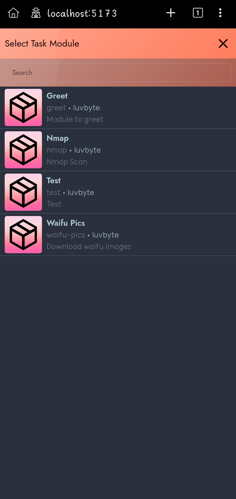
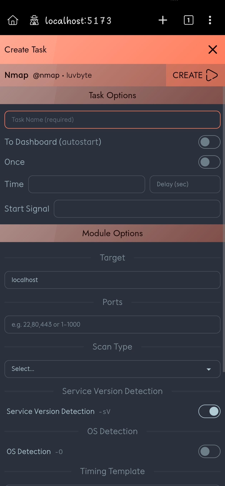
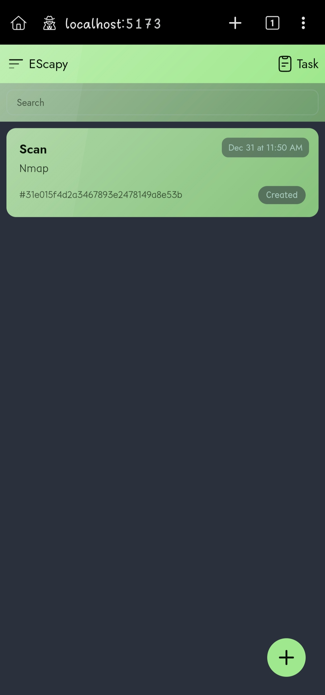
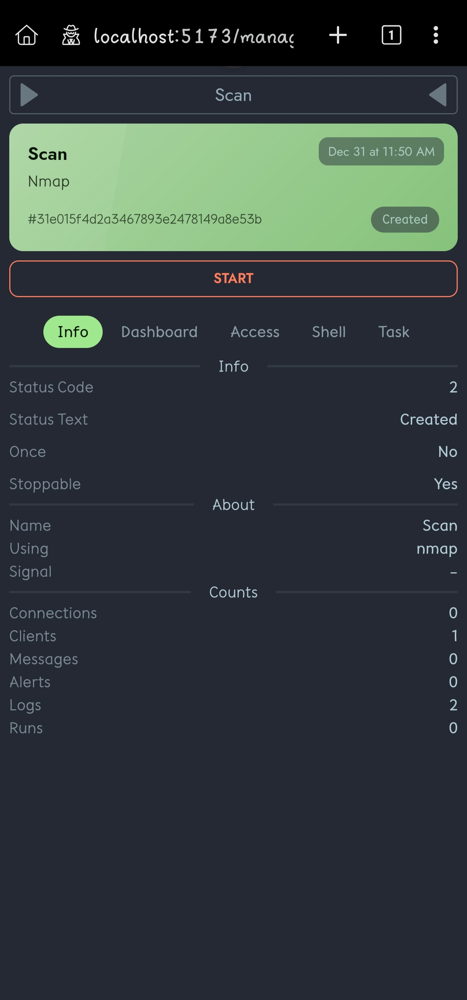
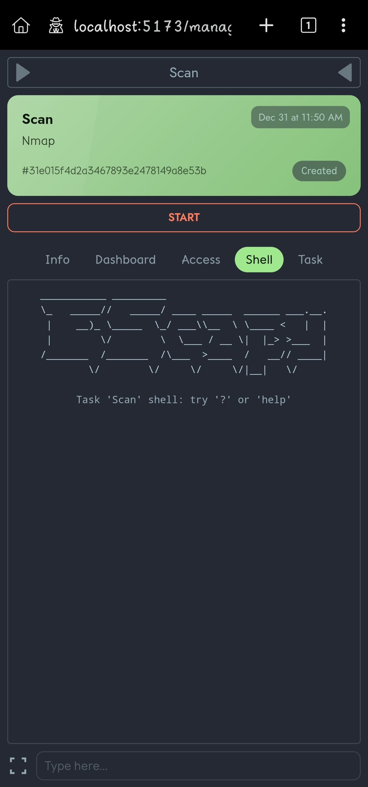
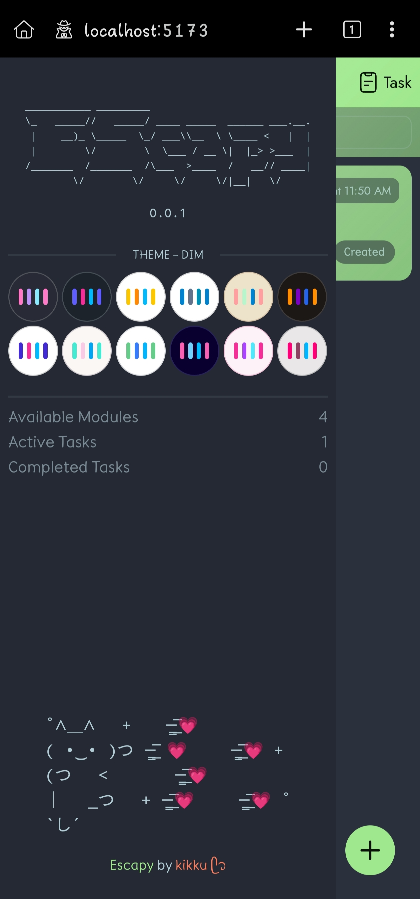

# Escapy
Escapy is a modular automation framework designed to create, manage, and monitor tasks through a unified system.
It provides a structured way to define modules, execute tasks, and interact with them using a real-time UI dashboard.

### NOTE: This project still under development








---
🔧 Installation (Development)

Requirements

Python 3.10+

Node.js 18+

Git

First clone repository

```sh
git clone https://github.com/luvbyte/escapy
cd escapy
```

Backend Setup

```sh
make
```

Frontend Setup

```sh
cd frontend
pnpm install
pnpm dev
```

visit

http://localhost:5173

---

🤝 Contributions

Pull requests and ideas are welcome! Help shape Nebula’s automation ecosystem.


